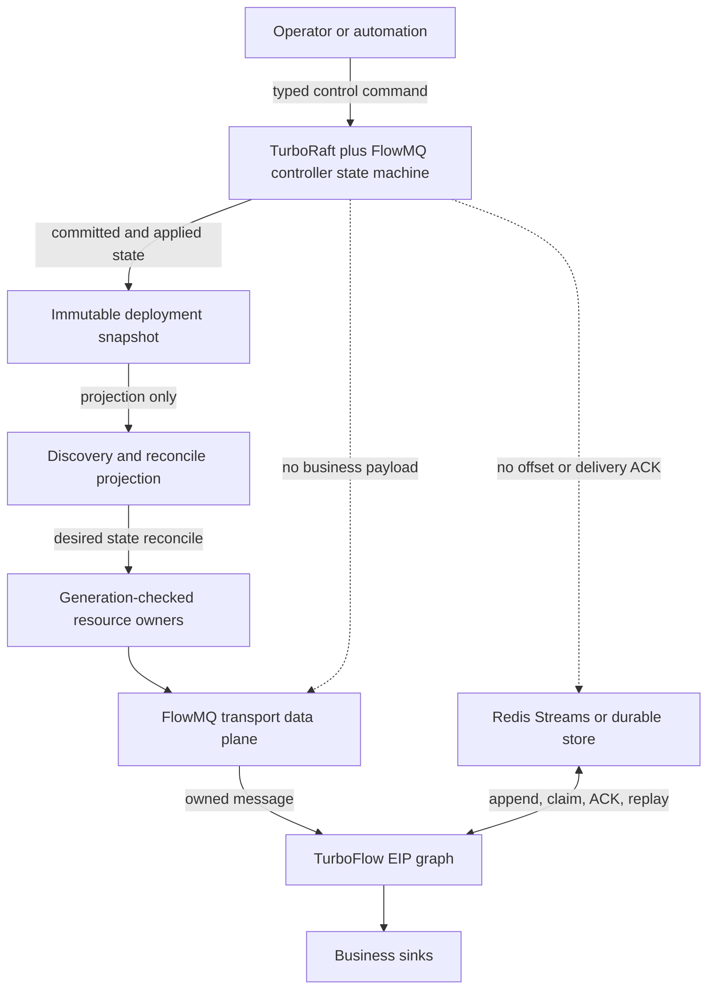
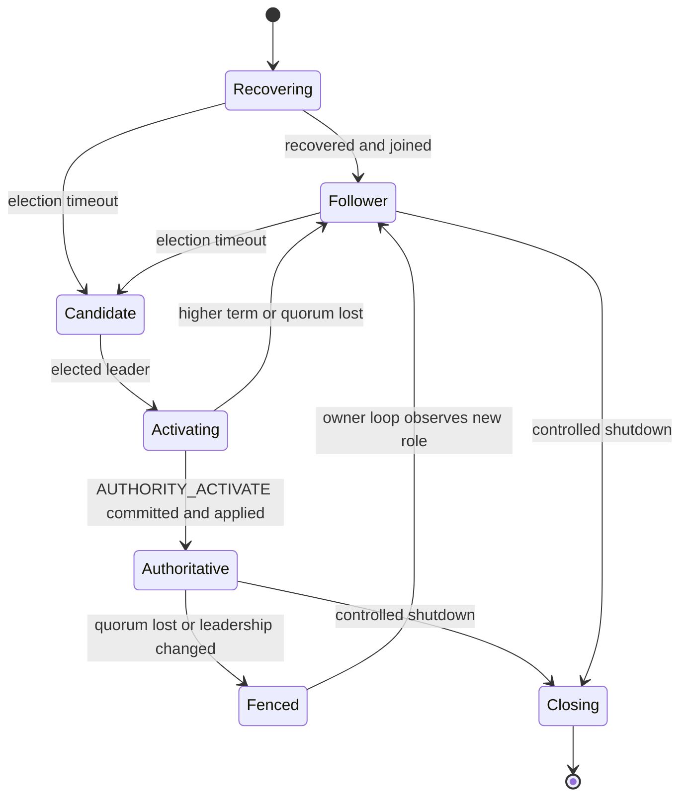
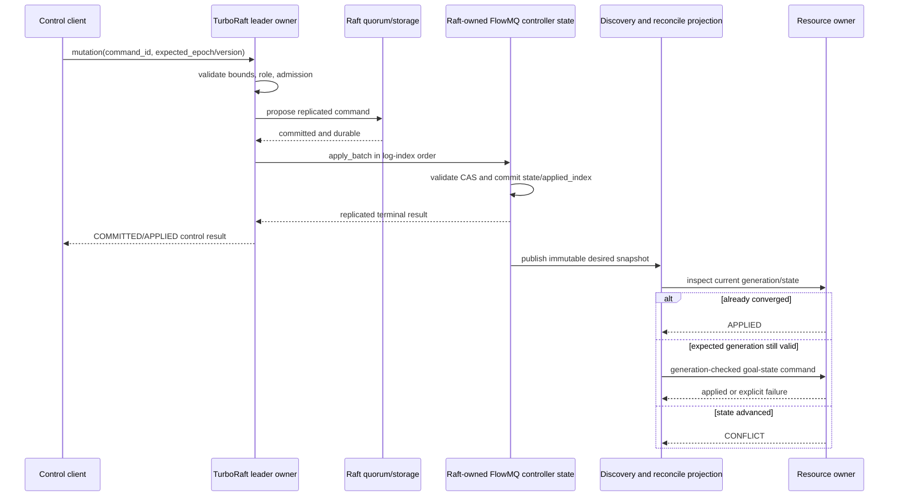
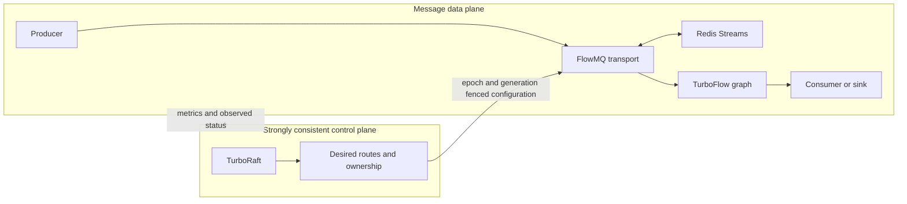
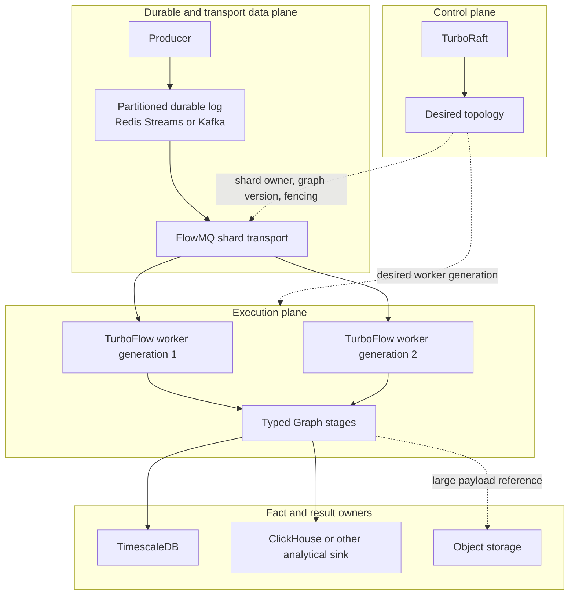
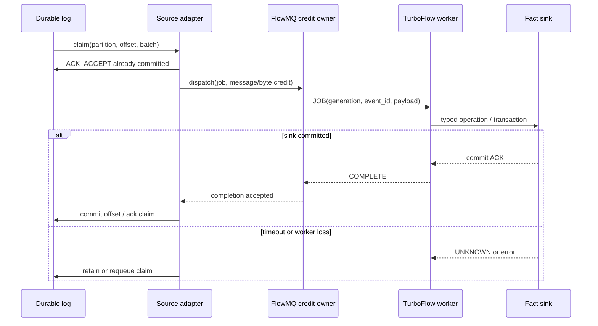
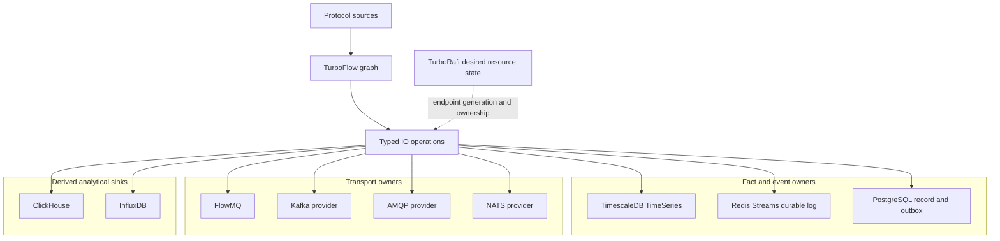

# TurboRaft FlowMQ Distributed Processing Feature Design

## Status

Proposed.

本文定义 TurboRaft 作为 FlowMQ deployment authority 的可选产品组合方式，并收敛跨机器业务数据处理的
控制面、传输面和计算面边界。它不修改
TurboFlow Graph 的消息执行语义，不替代 Redis Streams、FlowStore 或 PostgreSQL outbox，也不迁移
已经验证的 Flowie MQTT PostgreSQL/Redis 集群路径。

## Decision Summary

V1 采用以下边界：

- TurboRaft 复制 FlowMQ deployment control 的低频强一致状态：authority epoch、member identity、
  logical route primary、route generation、release identity 和 desired deployment state。
- FlowMQ/FM Q transport 继续拥有 socket、session、pattern、credit、correlation、HWM 和 transport ACK。
- Redis Streams 或其他显式 durable store 继续拥有消息持久化、consumer claim、replay 和 delivery ACK。
- TurboFlow 继续拥有进程内 Graph、消息所有权、路由、转换、聚合、backpressure 和 stage completion。
- 跨机器业务处理采用 partitioned durable log、FlowMQ transport 和 TurboFlow worker generation；Graph
  负责单个 worker 内的类型化处理拓扑，不自动拥有集群 partition、offset 或 checkpoint。
- 外部 resource mutation 不在 Raft state-machine apply 中执行。Raft 只提交 desired state，现有
  generation-checked resource owner 在 apply 之后执行 reconcile。
- Flowie MQTT 保持 PostgreSQL 为 membership、ownership、MQTT facts 和 outbox 的唯一事实源，
  Redis 保持派生事件流、路由索引和缓存；V1 不引入 TurboRaft/PG 双写。



## Background And Evidence

### Repository Facts

- `事实`：[FlowMQ deployment control](../flowmq/DEPLOYMENT_CONTROL.md) 已定义
  `authority_epoch` 必须由宿主单一 authority/election 服务单调分配，本地 controller 不实现
  distributed consensus。
- `事实`：[FlowMQ architecture](../flowmq/ARCHITECTURE.md) 已将消息持久化留给 Redis Stream 或其他
  durable store，并区分 accept ACK、transport send 和 delivery/completion ACK。
- `事实`：[TurboFlow architecture](../turbo_flow/ARCHITECTURE.md) 将 broker discovery、distributed
  routing、group ownership、socket/session/ACK 和数据库事务排除在 Core Graph 所有权之外。
- `事实`：[TurboRaft README](../../turboraft/README.md) 声明当前实现包含 Ready-style core、pre-vote、
  check-quorum、ReadIndex、leadership transfer、learners、Joint Consensus、SQLite recovery、snapshot
  transport 和 CoroNet mTLS peer service，但生产就绪仍需完成其 chaos、fuzz、长时间运行、滚动升级和
  跨平台验证门禁。
- `事实`：[TurboRaft runtime API](../../turboraft/include/turboraft/raft_runtime.h) 要求 storage
  transaction durable 后才能 transport send，并要求 `apply_batch()` 原子持久化 application state 与
  applied index。
- `事实`：[Flowie MQTT cluster ADR](../flowie/ADR_MQTT_CLUSTER_OWNERSHIP.md) 已选择 PostgreSQL
  transaction 同时验证 owner epoch、修改 MQTT fact 并写 outbox；Redis 是可重建派生层。
- `设计输入`：用户确认 Flowie MQTT PostgreSQL/Redis 路径已经完成验证。本特性不改变其
  [release gate](../flowie/RELEASE_GATE.md)、发布证据或运行路径。

### Architectural Gap

FlowMQ 已有 deterministic deployment controller、fencing tuple、release replacement 和 durable
side-effect reconcile，但跨进程 authority epoch、leader election 和 committed membership 仍由宿主提供。
TurboRaft 可以填补这一强一致 authority 缺口，而不要求 Graph 或 transport owner 复制自己的状态。

## Goals

1. 为一个 FlowMQ management domain 提供单一、持久、可恢复的 deployment authority。
2. 为每次 authority leadership activation 分配单调、可比较、可持久化的 fencing epoch。
3. 线性一致地提交 member、route、release 和 desired deployment state。
4. 复用现有 deployment controller 的 deterministic transition/validation 逻辑，并将 committed state
   投影为 Discovery/reconcile 可消费的 immutable snapshot。
5. 保持业务消息、consumer ACK、outbox 和外部副作用在现有 owner 边界内。
6. 支持三节点和五节点部署、leader failover、snapshot recovery 和 rolling replacement。
7. 所有可增长状态、command、snapshot、pending proposal 和 reconcile work 都有显式容量上限。

## Non-Goals

- 不把 TurboRaft 作为消息 broker、event log、queue、DLQ 或 replay store。
- 不把业务 payload、HTTP body、S3 object、MQTT packet、FMQ frame 或 FlowStore record 写入 Raft log。
- 不通过 Raft 提供 transparent exactly-once external side effects。
- 不复制 Redis consumer offset、PEL、每消息 ACK 或高频 telemetry。
- 不替换 TurboFlow Graph、FlowMQ wire pattern、Redis Streams 或 Flowie MQTT PostgreSQL/Redis 集群。
- 不在 V1 支持 WAN federation、跨独立 Raft group transaction 或在线 authority backend 切换。

## Ownership And Sources Of Truth

| State | Sole source of truth | Derived consumers | Must not own it |
| --- | --- | --- | --- |
| FlowMQ authority epoch | Raft-owned FlowMQ controller state machine | deployment snapshot, fencing token | Graph, Redis, adapter local config |
| FlowMQ committed membership | Raft-owned FlowMQ controller state machine | failure detector, Discovery, Observe | discovery cache, transport peers |
| Logical route primary/generation | Raft-owned FlowMQ controller state machine | Discovery, resource owners | individual adapters |
| Desired release/config identity | Raft-owned FlowMQ controller state machine | reconcile worker | Graph DSL, Observe |
| Socket/session/pattern state | FlowMQ transport owner | connection snapshot | TurboRaft, Graph |
| Durable message/replay/claim | Redis Stream or selected durable store | source adapter, operator tooling | TurboRaft, Graph runtime |
| Graph message and stage state | TurboFlow runtime generation | observer | TurboRaft, Redis control keys |
| Flowie MQTT facts/outbox | PostgreSQL | Redis projection, Flowie runtime | TurboRaft |

同一 deployment domain 只能配置一个 authority backend。`external` 与 `turboraft` 不能同时具有写权限；
启动时发现两个有效 authority identity、两个不同 normalized snapshots 或无法证明唯一 owner 时必须
fail fast，保持 deployment mutation admission closed。

## Proposed Product Boundary

新增一个 product-assembly module，暂定 target 为 `TurboFlow::FMQRaftAuthority`。它依赖
`TurboRaft::ServiceOwner`。现有 FlowMQ deployment controller 的 command transition、validation、
snapshot normalization 作为 deterministic application state machine 逻辑运行在 Raft ordered apply 中，
不能在 Raft 下游保留另一个可独立写入的 controller 实例。
它不进入 `TurboFlow::Flow`，也不向 `turbo_flow_msg_t` 添加 Raft 类型。

模块职责：

- 编解码有界、版本化、pointer-free authority commands。
- 用现有 deployment controller 领域逻辑实现 deterministic TurboRaft application state machine。
- 原子持久化 application state 与 applied index。
- 生成 immutable normalized deployment snapshot。
- 在 leader activation、command apply 和 snapshot publication 后唤醒 reconcile worker。
- 暴露只读 status、metrics 和 audit projection。

模块不负责：

- 创建或销毁业务 FlowMQ socket。
- 在 Raft apply callback 中调用 adapter/resource command。
- 写 Redis Stream、PostgreSQL 或任意业务 sink。
- 自动重试 outcome-unknown 的外部 mutation。

## Replicated State Model

每个 Raft group 对应一个 `authority_id`，application snapshot 至少包含：

```text
schema_version
cluster_id
authority_id
authority_epoch
active_leader_node_id
registry_version
release_identity
members[]
routes[]
recent_commands[]
last_applied_index
```

### Bounds

- `members`: 默认 32，硬上限 256。
- `routes`: 默认 256，硬上限由 deployment controller 现有上限约束。
- `recent_commands`: 有界 dedup window；容量必须覆盖最大 client retry horizon。
- member、route、endpoint、failure-domain 和 release identity 使用现有协议上限，不接受截断。
- 单 command 默认不超过 64 KiB，且不得超过 TurboRaft ServiceOwner 的配置上限。
- snapshot 大小在创建前 checked-add 计算；超过配置返回 `TURBO_ENOSPC`，不产生部分 snapshot。

### Command Identity

每个 mutation 携带：

- `command_id`: caller-unique stable ID。
- `expected_registry_version`: 防止 lost update。
- `expected_authority_epoch`: 防止旧 leader/client mutation。
- target-specific expected generation/incarnation。
- immutable release identity。

状态机保留 bounded `command_id -> terminal replicated result`。相同 command 和相同 digest 返回原结果；
相同 ID、不同 digest 返回 conflict。dedup window 之外的 client 不得盲目重试，必须先执行 linearizable
read 或使用新的业务 command ID。

## Authority Epoch And Fencing

Raft term 不直接作为公开 fencing token。term 属于 consensus implementation，可能在没有业务 state
transition 时变化。V1 使用 replicated `authority_epoch`：

1. 新 leader 完成 check-quorum 后提出 `AUTHORITY_ACTIVATE`。
2. command 携带当前 Raft term、leader node ID 和前一 authority epoch。
3. state machine 只接受精确前一 epoch，并将 `authority_epoch` 加一。
4. leader 只有在 activation 已 committed、durable 且 applied 后才打开 deployment mutation admission。
5. 所有后续 route/member mutation 和 resource reconcile 都携带该 epoch。
6. leadership 丢失、check-quorum 失败或 higher term 被观察到时立即关闭 admission。



`Activating` 期间允许 replication、ReadIndex recovery 和 diagnostics，不允许 deployment mutation 或
resource reconcile。旧 epoch 永久失效，不能因旧 leader 网络恢复而重新打开 admission。

## Membership And Failure Detection

Raft membership 与 FlowMQ deployment membership 是两个不同概念：

- Raft membership 决定 consensus voters/learners，由 TurboRaft Joint Consensus 管理。
- Deployment membership 描述 FlowMQ member、failure domain、endpoint、release 和 readiness，是
  application state machine 中的记录。

V1 不在 deterministic state machine 中读取 wall clock。member heartbeat 是当前 leader 的易失 liveness
observation；只有 membership/route mutation 才进入 Raft log：

1. Leader owner loop 接收并验证 member heartbeat。
2. heartbeat 更新 leader-local bounded observation，不直接推进 replicated registry version。
3. 超时后 leader 提出 `MEMBER_EXPIRE`，携带精确 member/incarnation/revision。
4. state machine 只按 identity/version 判定，不读取当前时间。
5. 新 leader 使用配置的 recovery grace period 重新收集 heartbeat，不能根据前 leader 的本地 deadline
   立即 expire member。

这样避免把高频 heartbeat 写入 Raft log，同时确保实际 owner/route 变更只有 committed command 能生效。

## Write Path



Raft command completion只表示 replicated control state 已提交并应用，不表示 socket 已重连、adapter 已
替换 endpoint 或外部系统已经完成副作用。控制 API 必须分别返回：

- `control_state`: `PENDING | COMMITTED | APPLIED | REJECTED`。
- `convergence_state`: `NOT_STARTED | CONVERGING | CONVERGED | DEGRADED | CONFLICT`。

不得把 `COMMITTED` 映射为外部副作用成功。

## Read Path

- 会影响写决策、fencing 或 operator mutation 的读取必须使用 TurboRaft `ReadIndex`，并等待
  `last_applied >= read_index`。
- follower local read 只能用于带 `stale=true` 标记的 diagnostics，不得驱动 route/resource mutation。
- deployment snapshot 包含 `authority_epoch`、`registry_version` 和 `last_applied_index`。consumer 只接受
  单调推进的同 authority snapshot；lower epoch/index 返回 stale。
- Observe 只读取 snapshot/metrics，不写回 Raft-owned controller state。

## Reconcile And External Side Effects

Raft apply 必须是确定性的本地状态提交，不得包含 network I/O、adapter callback、Redis/PG write 或用户
callback。committed desired state 与实际 resource state 之间使用现有 typed inspector：

- `APPLIED`: 已达目标，不重复 mutation。
- `NOT_APPLIED`: expected generation 仍成立时执行一次 goal-state command。
- `CONFLICT`: 状态已由其他 generation 推进，不覆盖。
- `UNKNOWN`: inspector 无法证明结果，保持 DEGRADED 并要求 operator/reconcile retry；不得自动假设失败。

`UNKNOWN` 是 product control 状态，不修改现有 FlowMQ inspector 的三值 wire/ABI。若现有 inspector 只能
返回 error，integration layer 将该 error 映射为本地 DEGRADED observation，而不是写入新的 replicated
desired state。

## Interaction With The Data Plane



控制面不可用时：

- 已建立的数据面连接是否继续服务由配置的 conservative policy 决定，但不得取得新 ownership、改变 route
  或执行 management mutation。
- leader/check-quorum 丢失立即关闭 mutation admission。
- 已持有 epoch 的 transport owner 必须在其本地 fencing/lease boundary 到期前自我隔离。
- Redis durable replay 和已提交 Graph work 不因 Raft 暂时不可用而被改写为成功或失败。

## Distributed Data Plane And Graph Composition

本节统一说明“数据量很大、需要多机处理”时的产品组合。`事实`：[FlowMQ 架构](../flowmq/ARCHITECTURE.md)
和 [bulk credit protocol](../flowmq/BULK_CREDIT_PROTOCOL.md) 已定义 pattern/session、batch、bounded
queue、HWM 和 credit-worker 组合；持久化 replay 由 Redis Stream 或其他显式 durable owner 提供。
`事实`：[TurboFlow Graph 架构](../turbo_flow/ARCHITECTURE.md) 已定义 typed operation、worker pool、
fan-out/fan-in 和有界 handoff。`推论`：FlowMQ 可以作为高吞吐实时 transport 和 worker dispatch，但单独
不能成为海量数据仓库、分布式 checkpoint service 或完整计算集群。

### Three-plane contract



| Plane | Sole source of truth | Responsibilities | Must not own |
| --- | --- | --- | --- |
| Control | TurboRaft application state | worker generation, shard ownership, route fencing, release/config identity | business payload, offset, per-message ACK |
| Durable data | Redis Streams, Kafka, or selected provider | partition log, retention, claim, replay, consumer offset | Graph deployment authority |
| Transport | FlowMQ session/pattern owner | cross-machine frame delivery, correlation, HWM, byte/message credit | durable completion result |
| Execution | TurboFlow runtime generation | decode, validate, transform, route, keyed state, window, retry, emit | protocol session or database transaction |
| Facts/results | PostgreSQL, TimescaleDB, ClickHouse, S3, or another explicit owner | committed business facts, analytical projection, large object bytes | worker placement and transport lease |

同一项状态只能由一层推进。例如 partition offset 由 durable log owner 推进，Graph 只提交处理结果；
TurboRaft 只提交 desired assignment，reconcile worker 再执行实际 endpoint/worker mutation。

### Partitioned cluster execution

业务 key 必须稳定映射到 partition，例如 `tenant_id`、`device_id` 或 `order_id`。同一 key 在一个
generation 内只允许一个 active worker route，从而保留 key 内顺序；不同 key 可以在不同 partition 和
worker 上并行。partition 数量、worker 数量、每 partition 处理速率和副本数都属于部署配置，不能深埋在
Graph DSL 或 Raft apply 逻辑中。

处理路径定义如下：

1. Producer 将消息追加到 durable log，得到 `ACK_ACCEPT`；此 ACK 只表示 durable owner 已接管消息。
2. Source adapter 按 partition claim 一批消息，并通过 FlowMQ ROUTER/DEALER 或 credit-worker 发送给
   worker。HWM 只限制本地 admission，byte/message credit 才表示 worker 可接受的容量。
3. Worker generation 执行已编译的 TurboFlow Graph；Graph 可组合 decode、validate、transform、filter、
   route、fan-out/fan-in、keyed state、event-time tumbling window、retry 和 reject edge。
4. Graph sink 将结果提交给显式 fact owner。只有 settlement 成功后，source adapter 才提交 offset 或
   `ACK_WORKER_COMPLETION`。
5. worker crash、route generation 变化或 lease expiry 时，旧 claim 进入 requeue/retry；新 generation
   从 durable log replay，不从 Raft snapshot 猜测业务进度。



### Graph expressiveness and state boundary

Graph 组合能力的承诺是“任意已注册 typed operation 的有限拓扑”，不是“任意动态程序都由 DSL
自动表达”。可复用 stage 具有明确 `in`/`out` ports；条件路由按每条消息求值；错误通过 retry 或 named
reject edge 处理。自定义领域能力应实现 provider/operation contract，再由 Graph 连接，而不是把数据库、
协议或外部 SDK 类型直接传播到 Graph 核心。

当前已支持的状态处理包括 node-local keyed state、count-based aggregate 和固定 event-time tumbling
window，具体边界见 [Graph domain contracts](../turbo_flow/DOMAIN_CONTRACTS.md)。以下能力不在本特性中隐式承诺：sliding/session window、early/late trigger、side output、
durable checkpoint、跨 sink exactly-once transaction、跨独立 partition 的全局顺序和跨 provider 原子
事务。需要这些能力时，必须新增独立 typed provider/owner，并定义恢复、watermark、版本和失败语义。

Graph 不拥有 socket session、MQTT ACK、Redis consumer group、FlowMQ lease 或数据库 transaction；这些
对象由原生 provider owner 管理。这样可以让同一 Graph 在进程内、单机多 worker 和跨机 worker generation
中复用，而不产生第二个事实源。

### Large payload and backpressure

FlowMQ v3 支持 frame fragmentation，但 facade send 会复制 payload；因此 fragmentation 不能被当作大文件
存储或零拷贝承诺。超过明确配置的 inline payload bound 时，消息应改为携带对象引用：
`object_uri`、content hash、byte size、schema version 和租约/保留截止时间。worker 在受控的 byte credit
下读取对象，并将处理结果写入事实 owner。

所有可增长队列都必须同时配置 item 和 byte 上限。admission 满时 fail fast 或暂停 claim；不得在 FlowMQ
pattern 内建立未声明的临时 durable queue。慢 sink 通过降低 credit、暂停 partition claim 和 bounded
retry 传播背压，不能无限堆积在 Graph 或 Raft 内存中。

### Delivery and consistency contract

默认语义为 `at-least-once + 幂等 sink`：每条消息携带稳定 `event_id`、source partition/offset、
attempt 和 Graph generation。sink 使用唯一键、版本条件写或幂等表消除 replay 重复。只有在 source offset、
state commit 和 sink transaction 由同一 provider 明确定义原子边界时，才可以声称更强语义；Raft commit、
transport send、HWM admission 和 credit consumption 都不能单独生成业务 completion ACK。

`UNKNOWN` 必须保留为可观察的结果未知状态。外部写入可能已经成功但响应丢失时，adapter 只能依据 provider
的幂等查询、transaction status 或人工补偿继续处理，不能静默重发造成双写，也不能直接标记为失败。

### Capacity model

分片容量按实测值计算：

```text
partitions >= ceil(target_messages_per_second / measured_messages_per_second_per_partition)
workers    >= ceil(active_partitions / partitions_per_worker)
network_bytes_per_second ~= messages_per_second * average_payload_bytes * replica_factor
```

上述计算只描述容量下限；fan-out、序列化复制、TLS、sink latency、重试和 rebalance 会增加实际成本。发布
前必须分别测量单 partition、单 FlowMQ shard、跨机 worker pool、durable replay 和 sink settlement 的
P50/P95/P99，不得用单机 Graph benchmark 推断集群吞吐。

## IO Provider Expansion

TurboRaft control plane 不限定数据面只能使用 FMQ 和 Redis。企业消息产品需要通过已有 typed operation、
adapter 和 StorageBackend 边界扩展 IO provider，而不是把 provider protocol 写进 Graph 或 Raft。

### Existing Storage Boundary

`事实`：[FlowStore ADR](../flowstore/ADR_FLOWSTORE.md) 已将业务事实分成 Record、State、Index、Log 和
TimeSeries 五种模型。StorageBackend ABI 已定义 `TURBO_FLOW_STORAGE_CAP_SERIES`；
[Series provider API](../flowstore/include/turbo_flow_series_store_provider.h) 已包含 `append`、`range`、
`aggregate`、`trim_before` 和 `stats`。当前 local backend 实现 TimeSeries，而 Redis/PostgreSQL backend
均未声明 Series capability。

因此新增时间序列数据库应实现现有 FlowStore Series provider，不新增第二套 `timesdb.*` Graph 状态 API。



图中的每个 provider 都是独立 owner。箭头表示显式 operation/adapter 调用，不表示跨 provider transaction、
共享 ACK 或自动 fallback。

### Provider Roadmap

| Priority | Proposed module | Role and owner | Initial delivery contract | Decision |
| --- | --- | --- | --- | --- |
| P0 | `TurboFlow::TimescaleDB` | FlowStore TimeSeries fact owner | transaction commit is durable append ACK | selected first |
| P1 | `TurboFlow::Kafka` | partitioned event-log and consumer-group owner | broker append ACK; consumer offset after settlement | separate feature design required |
| P1 | `TurboFlow::AMQP` | queue/exchange delivery owner | publisher confirm and consumer ACK remain distinct | separate feature design required |
| P1 | `TurboFlow::ClickHouse` | append/query analytical sink | insert acceptance, not business transaction completion | analytical projection only |
| P2 | `TurboFlow::InfluxDB` | native time-series provider | server write ACK plus explicit query/retention capability | evaluate after TimescaleDB contract tests |
| P2 | `TurboFlow::NATS` | low-latency transport; JetStream is a separate durable mode | core publish and durable stream ACK must not be conflated | evaluate after broker SPI is stable |

Kafka、AMQP 和 NATS 不能共享一个模糊的 `message_bus` adapter。它们可以复用消息 ownership、settlement、
retry 和 resource-provider 基元，但 partition、consumer group、publisher confirm、redelivery 和 durable
stream state 仍属于各自 provider。

### TimescaleDB Module

#### Product Boundary

新增 `io/timescaledb` shared module，导出 target `TurboFlow::TimescaleDB` 和 backend identity
`timescaledb`。它使用现有 PostgreSQL client dependency 连接启用了 TimescaleDB extension 的服务，
只声明 `TURBO_FLOW_STORAGE_CAP_SERIES`。缺少 server extension、schema、权限或所需 capability 时
`open()` fail fast，不降级到普通 PostgreSQL table、Redis、local memory 或 HTTP ingestion。

模块通过 `turbo_flow_series_store_create_provider()` 返回 provider-neutral
`turbo_flow_series_store_t`。Graph、Flowie 和 product composition 不接触连接句柄、SQL result 或
TimescaleDB-specific type。

#### Data Model

建议使用两个逻辑表：

```text
series_catalog
  namespace
  series_id
  binary_series_key
  value_kind
  last_timestamp_ms
  records
  logical_bytes
  revision

series_samples
  series_id
  timestamp_ms
  bool_value | int64_value | double_value
  value_digest
```

- `(namespace, binary_series_key)` 唯一定位 series；key 保持 binary-safe，不转成未经约束的字符串 label。
- `(series_id, timestamp_ms)` 唯一定位 sample，并包含时间分区列。
- 一个 series 的 `value_kind` 创建后不可变化；bool、int64 和 double 不互相隐式转换。
- `series_catalog` 是 per-series ordering、capacity 和 duplicate-policy transaction 的锁定点。
- `series_samples` 是采样事实源；continuous aggregate、compression metadata 和查询 cache 只能是派生层。

#### FlowStore Contract Mapping

| FlowStore operation | TimescaleDB behavior | Completion meaning |
| --- | --- | --- |
| `append` | lock catalog row, validate kind/order/capacity, apply duplicate policy, commit | sample and metadata transaction durable |
| `range` | exact series lookup, inclusive time range, `timestamp_ms ASC`, bounded copy-out | read snapshot completed |
| `aggregate` | COUNT/SUM/MIN/MAX/AVG over the selected typed value column | aggregate query completed |
| `trim_before` | synchronous bounded delete plus catalog counter update | returned row count committed |
| `stats` | catalog counters plus provider-owned errors/query/peak counters | observation only |

`append` 保持现有默认不变量：同一 series 的 timestamp 单调不减。transaction 先锁定 catalog row，再检查
`last_timestamp_ms`、duplicate policy、`max_records`、`max_bytes` 和 integer overflow，最后一次提交 sample
与 counters。任何失败都不能推进 timestamp、revision 或容量计数。

Duplicate policy 映射：

- `REJECT`: 已存在 timestamp 返回 `TURBO_EALREADY`。
- `KEEP_FIRST`: 已存在 timestamp 返回 `TURBO_OK`，不修改原 sample。
- `KEEP_LAST`: 在同一 transaction 更新 typed value 和 digest，不增加 record count。
- 小于 `last_timestamp_ms` 且不是同 timestamp 的写入返回 `TURBO_ERANGE`，不自动排序或修复。

`trim_before` 必须提供同步精确语义。TimescaleDB native asynchronous retention policy 可以作为运维优化，
但不能替代公共 API 的 delete/count completion，也不能让 `stats` 把尚未删除的数据报告为已删除。

#### Concurrency And Outcome Ambiguity

- 每个 provider instance 串行化同一 connection owner；连接池中的不同 connection 仍通过 catalog row lock
  串行化同一 series。
- 不允许同一 namespace 使用不同 limits 或 duplicate policy 的独立 writer；初始化 metadata 不一致返回
  `TURBO_EBUSY`。
- database commit reply 丢失时，普通 `append` 返回 outcome unknown 的 I/O error，不自动重放 `REJECT` 或
  `KEEP_LAST`。
- `KEEP_FIRST` 可以在重新读取精确 `(series_id, timestamp_ms)` 并验证 value digest 后判定幂等成功。
- 需要跨进程可靠批量 ingestion 的产品必须使用独立、带 `command_id` 的 durable ingest/outbox operation，
  不能从单 sample FlowStore API 推导 exactly-once。

#### Graph Adapter Surface

TimeSeries backend 与 Graph sink 是两个层次：

1. StorageBackend 创建并拥有 `turbo_flow_series_store_t`。
2. 可选 `timeseries.append` typed operation 从消息 metadata/schema 提取 series key、timestamp 和 scalar。
3. operation 调用 provider-neutral `turbo_flow_series_store_append()`，不直接执行 SQL。
4. transaction commit 后才能报告 storage accept ACK；后续 Graph stage completion 不是数据库 ACK。

`timeseries.append` 必须显式绑定可信 schema mapping。动态 label map、任意 SQL、table name 或 value kind
不能从消息 payload 直接控制。批量写入作为后续 additive operation；第一版不通过隐藏 buffer 改变单消息
completion 语义。

#### Proposed Configuration

配置属于 StorageBackend channel，不进入 `.flow` DSL：

```yaml
channels:
  telemetry-series:
    kind: series_store
    config:
      backend: timescaledb
      conninfo: "host=timescaledb.internal port=5432 dbname=telemetry user=turboflow"
      password_ref: env://TURBOFLOW_TIMESCALE_PASSWORD
      namespace_name: telemetry-v1
      max_records: 100000000
      max_bytes: 68719476736
      max_item_bytes: 4096
      retention_ms: 2592000000
      full_policy: reject
      duplicate_policy: reject
```

`password_ref` 由 host secret provider 解析；`conninfo` 不允许包含 password。resolved snapshot 和 Raft
control state 只携带非秘密的 endpoint identity/generation，不保存 password、TLS private key 或完整
connection string。

#### Control Plane Integration

TimescaleDB resource provider 至少公开：

- stable UID、endpoint identity、schema version、connection state 和 generation。
- current/peak requests、records/bytes、write/query/reject/conflict/backend-error counters。
- quiesce/resume 和 generation-checked endpoint replacement。
- schema/extension capability document；document 只观察，不自动执行 migration。

TurboRaft 可以复制 desired endpoint generation、release identity 和 quiesce goal，但不能复制 series sample、
SQL transaction、retention cursor 或 connection pool state。schema migration 是独立 operator workflow：先
quiesce、drain、backup/verify、执行 migration、重新 open/inspect，再提交新的 desired schema identity。

#### TimescaleDB Verification

- provider-neutral Series contract suite：bool/int64/double、binary key、duplicate/ordering、range、所有
  aggregate、trim、stats、capacity 和 close。
- real TimescaleDB integration：extension/schema probe、transaction rollback、connection loss、lost commit
  reply、restart recovery、retention 和 concurrent writers。
- property tests：records/bytes/last timestamp 与事实表重算结果一致。
- benchmark：single append、transaction batch baseline、range、aggregate、trim、high-cardinality series、
  retention boundary 和 reconnect；报告 P50/P95/P99、rows/s、bytes/s 和 DB CPU/storage growth。
- security：TLS verification、credential rotation、least-privilege role、SQL identifier isolation 和 payload
  redaction。

### Common IO Provider Contract

后续所有 IO module 必须在实现前声明以下边界：

| Concern | Required declaration |
| --- | --- |
| Fact owner | broker, database, object store, or provider-local state |
| Input ownership | copy, retain, move, or borrowed-until-return |
| Accept ACK | exact point at which provider owns durable work |
| Delivery ACK | exact downstream/consumer settlement point, if supported |
| Outcome unknown | inspect, idempotency key, or explicit no-auto-retry |
| Ordering | global, partition, key, connection, or none |
| Replay | source cursor/offset owner and retention boundary |
| Backpressure | records, bytes, inflight and timeout limits |
| Control resource | UID, generation, snapshot/document/command |
| Shutdown | close admission, drain accepted work, settle/retain, release owner |

一个 provider 只有通过对应 contract/conformance suite 后才能出现在 product `Implemented modules` 列表。
仅能连接服务或成功发送一次请求，不构成 enterprise delivery semantics。

## Error Semantics

| Condition | Result | State after failure |
| --- | --- | --- |
| Not leader | typed not-leader plus leader hint when known | no state mutation |
| Leader not activated | `TURBO_EBUSY` | admission remains closed |
| Stale authority epoch/version | `TURBO_EBUSY` | newer state unchanged |
| Duplicate command, same digest | prior terminal result | no duplicate mutation |
| Duplicate command, different digest | conflict | state unchanged |
| Command or snapshot exceeds bound | `TURBO_ENOSPC`/`TURBO_EMSGSIZE` | state unchanged |
| Raft storage/apply failure | service FAULTED | proposals and linearizable reads rejected |
| Quorum unavailable | unavailable/timeout | no new committed control mutation |
| Resource inspector error | convergence DEGRADED | committed desired state retained |
| Resource generation conflict | convergence CONFLICT | newer resource state retained |

Timeout 只描述 caller wait，不证明 proposal 未提交。caller 必须使用相同 `command_id` 查询 operation status，
不能用新的 command ID 盲目重放。

## Threading And Lifecycle

- TurboRaft ServiceOwner 的 CoroNet context thread 是 consensus service 和 authority state 的唯一可变 owner。
- storage 使用 TurboRaft 自己的有序持久化边界；不得在 owner loop 做阻塞磁盘 I/O。
- deployment snapshot 是 immutable owned copy，通过 bounded mailbox 交给 reconcile worker。
- reconcile worker 不持有 Raft internal pointer，不在 Raft callback 内调用 FlowMQ/resource APIs。
- 同一 authority group 最多一个 active reconcile worker；新 snapshot 合并为 latest desired state，但正在执行的
  generation-checked command必须完成或进入明确 terminal observation。

启动顺序：恢复 storage/application snapshot，启动 peer service，形成 quorum，完成 leader activation，发布
首个 snapshot，最后打开 management mutation。停止顺序相反：关闭 mutation，停止 reconcile admission，
drain accepted reconcile，停止 peer admission，持久化 terminal state，关闭 ServiceOwner。

## Configuration And Compatibility

建议增加 product-level 配置，不进入 `.flow` DSL：

```yaml
control:
  authority:
    backend: external # external | turboraft
    authority_id: fmq-production
    cluster_id: cluster-a
    recovery_grace_ms: 15000
    max_members: 32
    max_routes: 256
```

- 默认 `external`，保持现有用户可见行为。
- `turboraft` 是显式 opt-in；缺少 node identity、peer set、storage path、TLS identity 或容量配置时 fail fast。
- backend 运行中不可热切换；切换需要 stop/drain/export/verify/start 迁移流程。
- 不修改 FMQ/3、TFMP/1 或 TurboFlow message ABI。
- 新 target 不应把 TurboRaft 类型传播进 `turbo_flow.h`。
- 引入导出 target 前必须修复 TurboFlow installed package dependency/component contract，并增加 repo 外
  consumer package test。

## Security

- Raft peer transport 使用 CoroNet mTLS；cluster/node identity 必须与证书授权身份匹配。
- control mutation 要求 authentication、authorization、request ID 和 audit actor。
- private key、command payload、snapshot payload 不进入普通日志。
- membership、authority activation、route owner、release replacement 和 forced operator action 写结构化审计。
- follower diagnostics 默认只读；mutation 只接受 leader owner-loop path。
- snapshot/install 校验 cluster ID、authority ID、schema version、index/term、size 和 digest。

## Performance And Capacity

本特性只处理低频控制状态，不承诺提升消息吞吐。复杂度目标：

- command lookup/dedup: average `O(1)` bounded map。
- route/member mutation: `O(1)` lookup，snapshot normalization 最多 `O(m log m + r log r)`。
- application snapshot: `O(m + r + d)` time and space，其中 `d` 为 dedup window。
- data path: 每消息不进行 Raft proposal、ReadIndex 或 mutex acquisition。

基准必须分别报告 proposal commit P50/P95/P99、leader failover、snapshot create/install、reconcile latency 和
数据面启用前后吞吐。若只启用控制面就使 steady-state FMQ data-plane throughput 下降超过 5% 或 P99 上升
超过 10%，必须说明共享线程/CPU/allocator 原因并修复或隔离。

## Alternatives

| Option | Advantages | Risks | Decision |
| --- | --- | --- | --- |
| Keep external authority only | no new dependency | every host must supply consensus/fencing | retained as default |
| Put membership in Graph stages | simple configuration | control/data facts mix; replay can mutate authority | rejected |
| Let each adapter elect locally | local implementation | split-brain and incompatible epochs | rejected |
| Store business messages in Raft | one apparent durable log | quorum latency, log/snapshot growth, wrong ownership | rejected |
| Replace Flowie PG/Redis with Raft | fewer named technologies | breaks verified transaction/outbox boundary | rejected for V1 |
| TurboRaft control authority plus existing data owners | fills exact consensus gap | new deployment and validation burden | selected |

## Migration

V1 只允许从 stopped external authority 迁移到 stopped TurboRaft authority：

```mermaid
flowchart LR
    A[External authority active]
    B[Close mutation admission]
    C[Drain operations and outbox]
    D[Export normalized snapshot]
    E[Verify identities versions and bounds]
    F[Bootstrap TurboRaft group]
    G[Commit IMPORT_BASELINE]
    H[Activate new authority epoch]
    I[Publish and reconcile]

    A --> B --> C --> D --> E --> F --> G --> H --> I
```



迁移要求：

1. 所有旧 external-authority controller 停止写入并完成 drain。
2. 导出包含 authority identity、registry version、member/route generation 和 release identity 的 normalized
   snapshot；不导出 socket、deadline、message、ACK 或 Redis offset。
3. 校验 snapshot digest、schema、容量和所有引用。
4. 新 Raft group 通过唯一 `IMPORT_BASELINE` command 提交，空 group 之外拒绝 import。
5. 新 leader 提交更高 `authority_epoch` 后才允许 reconcile。
6. 旧 backend 永久切为 read-only archive，不允许自动 fallback。

Flowie MQTT PostgreSQL/Redis 路径不参与此迁移。未来若重新评估 Flowie authority，必须单独提交 ADR，证明
PostgreSQL lease 已成为实测瓶颈，并重新设计 PG fact/outbox 与 Raft control state 的事务边界。

## Rollback

启用 TurboRaft 后不能在运行中自动回退 external authority，因为旧 backend 不拥有最新 epoch 和 registry。
回滚必须：

1. 关闭 mutation admission。
2. 停止并 drain reconcile 和 transport owner mutation。
3. 取得 linearizable committed snapshot 并验证所有 pending command terminal 状态。
4. 停止整个 Raft authority group。
5. 离线导入 external backend，分配严格更高且不可与旧 token 混淆的新 epoch namespace。
6. 重新启动并完成全量 resource inspect 后再开放 admission。

若无法取得 quorum，但仍保留多数节点的可恢复 storage，应先恢复 Raft quorum，不得从 follower local snapshot
猜测最新状态。丢失多数的灾难恢复遵循 TurboRaft offline recovery contract，不提供自动 unsafe recovery。

## Validation And Release Gates

### Contract Tests

- authority activation before admission；旧 leader、旧 epoch 和旧 incarnation 永久 fenced。
- duplicate command same/different digest、dedup eviction 和 timeout 后 status 查询。
- ReadIndex 必须等待 applied index；stale follower read 不得驱动 mutation。
- member expire exact identity/version、leader recovery grace 和 route generation monotonicity。
- desired-state commit 与 resource side effect 分离；inspector APPLIED/NOT_APPLIED/CONFLICT/error。
- snapshot round trip、schema mismatch、capacity overflow、corruption 和 install interruption。
- startup/shutdown/drain，在每个持久化与 reconcile crash window 注入失败。

### Integration Tests

- 三节点和五节点 authority group，leader kill、minority partition、majority loss/recovery。
- CoroNet mTLS identity mismatch、certificate rotation 和 duplicate connection resolution。
- FlowMQ route failover 后旧 epoch transport mutation 被拒绝。
- Redis Streams replay/PEL/ACK 在 authority failover 前后保持原事实源语义。
- TurboFlow Graph fan-out/retry/dead-letter 行为不因 authority backend 改变。
- 多机 partition rebalance、worker generation fencing、慢 sink credit 收缩和 bounded queue admission。
- durable claim 在 worker crash、lost completion 和 sink outcome `UNKNOWN` 后只产生可证明的 replay/幂等结果。
- 大 payload reference、object hash 校验、跨机 batch、重试和对象读取失败的 backpressure 行为。
- keyed order、event-time watermark、fan-out/fan-in 以及 Graph stop/start 后 runtime-generation state 清理。
- Flowie MQTT PostgreSQL/Redis release suite 保持通过，证明本特性没有穿透其事实边界。

### Release Preconditions

1. TurboRaft 自身 chaos、fuzz、long-duration、rolling-upgrade 和目标平台门禁通过。
2. TurboFlow installed package/consumer test 能正确解析新增 TurboRaft dependency 和 exported target。
3. HTTP/S3 completion timeout ambiguity 已修复或明确不进入任何 automatic retry/reconcile path。
4. 被控制的 FlowMQ resources 已实现 generation-aware resource provider command；旧 adapter command 只作为
   compatibility wrapper。
5. adapter instance lifecycle 与 stage binding lifecycle 已明确，stop 不依赖偶然幂等。
6. data-plane benchmark、control-plane benchmark 和 failure-injection evidence 随发布保存。
7. 多机数据面必须提供 partition、worker、durable log 和 sink 四层的独立容量与故障证据；单机 Graph
   benchmark 不得作为集群吞吐声明。
8. TimescaleDB 进入 implemented product list 前，provider-neutral Series contract、真实服务故障注入、
   credential-free status document 和 repo 外 package consumer test 全部通过。
9. Kafka、AMQP、ClickHouse、InfluxDB 和 NATS 必须分别完成 feature design、依赖/许可证审查、ACK/settlement
   contract 和 live conformance suite；本 roadmap 不等于实现授权或发布声明。

## Consequences

正面影响：FlowMQ 获得与现有 fencing contract 匹配的强一致 authority，leader failover、membership、route
generation 和 release identity 有持久单一事实源；partitioned durable log、FlowMQ transport 和
TurboFlow worker generation 可以独立水平扩展，且 Graph 不承担 consensus 成本。

代价：产品增加 quorum、证书、storage、snapshot、backup、rolling upgrade 和灾难恢复运维；控制命令必须处理
not-leader、pending、timeout outcome unknown 与 asynchronous convergence；production release 需要同时满足
TurboRaft 和 FlowMQ 两组门禁。

最重要的约束保持不变：Raft commit 不是业务消息 delivery ACK，也不是外部副作用 exactly-once 证明。
